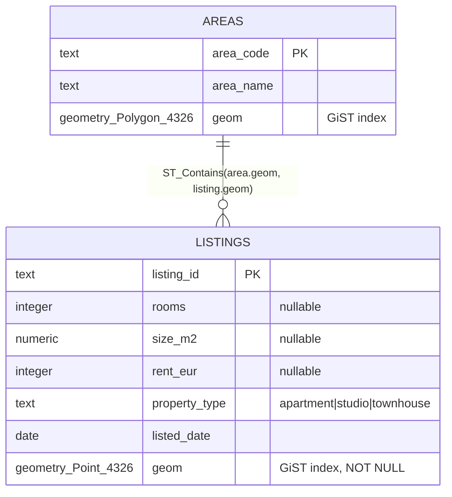

# Rent Explorer

Interactive map of ~850 Helsinki-metro rental listings: filter by rent / rooms / type, and read median €/m² by area from a choropleth.

**Stack:** Python + Flask (gunicorn) · PostgreSQL 16 + PostGIS · SQLAlchemy 2.0 + GeoAlchemy2 · React + TypeScript + Vite · Leaflet · TanStack Query.


## Architecture Overview


Three services, orchestrated by `docker compose`:

| Service | Role |
|---|---|
| **`db`** | PostgreSQL + PostGIS. Listings as `geometry(Point,4326)`, areas as `geometry(Polygon,4326)`, both GiST-indexed. |
| **`api`** | Flask. Loads + cleans the data on startup, then serves three read-only REST endpoints. |
| **`web`** | React + Vite. Map with listing pins, area choropleth + legend, filters, popups, summary panel. |

#

## Getting Started

### 0. Prerequisites

- **Docker Desktop**, running.
- The two source data files — not committed to git (see [Setup](#setup)).
- *(Optional)* Node.js, for editor tooling outside the container.


### 1. Clone the repository

```bash
git clone https://github.com/rifatshampod/rent-explorer.git
cd rent-explorer
```

### 2. Add the data files

`listings.csv` and `helsinki_areas.geojson` are gitignored and must be supplied manually. Place them in `data/` at the repo root:

```
data/
├── listings.csv            # ~850 rental listings
└── helsinki_areas.geojson  # 12 area polygons
```

### 3. Configure (optional)

Defaults cover local use. To override, copy the template, see [Configuration](#configuration) for more details.

```bash
cp .env.example .env
```


### 4. Running the app

```bash
docker compose up --build -d
```

| Application | URL |
|---|---|
| Webapp (map UI) | http://localhost:5173 |
| API Backend  | http://localhost:8000 |
| API Documentation| http://localhost:8000/apidocs |


#

## Configuration

It is recommended to use all configuration via environment variables. 

`docker compose` reads `.env` from the repo root (gitignored) and substitutes it into `docker-compose.yml`. `.env.example` is the committed reference. Every variable also has a `${VAR:-default}` fallback in compose, so the stack runs with no `.env` — the defaults below are **local-development values only**.

| Variable | Default | Purpose |
|---|---|---|
| `POSTGRES_USER` | `rentdbuser` | Database user |
| `POSTGRES_PASSWORD` | `rentStrongPassword` | Database password |
| `POSTGRES_DB` | `rentexplorer` | Database name |
| `DB_PORT` | `5432` | Host port → Postgres |
| `API_PORT` | `8000` | Host port → API |
| `WEB_PORT` | `5173` | Host port → frontend |
| `VITE_API_URL` | `http://localhost:8000` | API base URL the browser calls |
| `CORS_ORIGINS` | `http://localhost:5173,http://localhost:3000` | Origins the API accepts |

`DATABASE_URL` is derived from `POSTGRES_USER/PASSWORD/DB` inside compose, so the credentials have a single source and can't drift between `db` and `api`.

> **Production:** supply secrets from a secret manager, restrict `CORS_ORIGINS` to the real frontend origin, set `VITE_API_URL` to the public API URL, and serve a static `vite build` behind a CDN instead of the dev server.

#

## How it works

### Data model

Two spatial tables, joined by geometry — there is no `area_code` foreign key on `listings`. Area membership is resolved at query time via `ST_Contains`, so it stays correct if boundaries change.



### API reference

| Method | Path | Purpose |
|---|---|---|
| GET | `/listings` | Filter by map **bbox** (`min_lng,min_lat,max_lng,max_lat`) + `rent_min`, `rent_max`, `rooms`, `property_type`. |
| GET | `/areas/stats` | **GeoJSON** FeatureCollection: per-area `median_rent`, `median_eur_per_m2`. |
| GET | `/listings/near` | Listings within `radius_m` of `lat,lng`, nearest first. |
| GET | `/health` | Liveness + DB check. |

```
GET /listings?min_lng=24.90&min_lat=60.15&max_lng=25.00&max_lat=60.25
GET /listings?rent_min=1000&rent_max=1500&property_type=apartment
GET /listings/near?lat=60.17&lng=24.94&radius_m=1000
```

Interactive docs at `/apidocs`.

### Data cleaning

Cleaning runs once at load time and logs every decision. Rule: **no usable coordinate → drop; missing attribute → keep** (SQL aggregates skip the `NULL`). Load result: `849 inserted, 1 dropped, 3 kept-with-null`.

| Row | Issue | Action |
|---|---|---|
| `L0780` | latitude `61.05`, ~83 km north of the metro | Dropped |
| `L0452` | missing `rooms` | Kept; `rooms = NULL` |
| `L0490` | missing `rent_eur` | Kept; excluded from rent medians |
| `L0687` | missing `size_m2` | Kept; excluded from €/m² |


## Design decisions


| Decision | Why | Trade-off |
|---|---|---|
| **Flask** over FastAPI | Matches the platform stack | No auto API docs, added Swagger manually, additional time and efforts were the trade-offs |
| **`text()` SQL** over ORM query chains | Keeps the PostGIS calls visible and easy to follow | Less ORM abstraction |
| **Swagger via flasgger** (not required) | Self-documenting, try-it-live API at `/apidocs` | Extra dependency |
| **gunicorn**, not the Flask dev server | Production-grade WSGI server | — |
| **Frontend runs inside `docker compose`**, not a separate host `npm` server | One command (`docker compose up`) brings up db + api + web; reviewer needs no local Node, no version drift, startup order handled by `depends_on` | Runs the Vite dev server in-container (hot reload via mounted volume), not a static production build |
| **Listings as the primary layer**, choropleth as a faint background tint | User's main question is "where are the listings"; price is supporting context | Exact area price is less prominent (opacity slider restores it) |
| **Cluster listings when zoomed out** | ~850 pins overlap into an unreadable blob at metro zoom; clusters show counts and split apart as you zoom in | Individual pins only appear once zoomed in |

### One non-trivial decision

**I clean the messy rows once at load time, not inside every query.** The rule:

- **No usable location → drop the row.** A missing or out-of-area coordinate
  (e.g. `L0780` at lat 61.05, ~83 km north) can't go on a map, so it never enters
  the database.
- **Missing only an attribute → keep the row, store `NULL`.** It still has a valid
  location. SQL aggregates skip `NULL`, so a missing rent just doesn't count toward
  that area's median — no distortion.

**Why load-time:** the database then holds only clean rows, so every endpoint
stays simple instead of repeating the same validation (and risking two endpoints
doing it differently). The cost is that stored data no longer mirrors the raw file
one-to-one — so the loader logs every drop and keep, making it auditable.

### With more time

- Radius-search UI (the `/listings/near` endpoint already exists).
- Static production frontend build + production compose.
- CI running the test suite.
- URL-synced filters and viewport so a given map view is shareable/bookmarkable.

---

## Project structure

```
rent-explorer/
├── docker-compose.yml          # db + api + web
├── .env.example                # env var reference
├── data/                       # source files (gitignored)
├── backend/                    # Flask API
│   ├── app.py, config.py, db.py, models.py, schema.sql, load_data.py
│   ├── validation.py, routes/, tests/
│   └── Dockerfile, entrypoint.sh, requirements.txt
└── frontend/                   # React + TypeScript map UI
    ├── src/ (api/, hooks/, lib/, components/, App.tsx)
    └── Dockerfile, package.json, vite.config.ts
```
