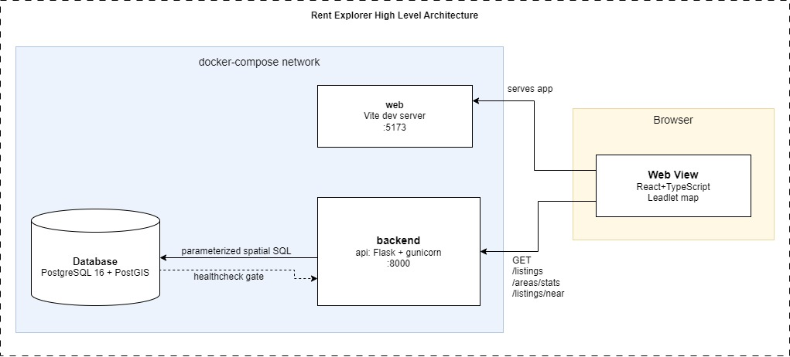

# rent-explorer
A mini **location-intelligence** tool for the Helsinki metro rental market: an interactive map that lets a non technical user explore ~850 rental listings, filter them, and see how price varies by area.

# Rent Explorer — Project Context & Conventions

## What this is
A mini location-intelligence tool: an interactive map of ~850 Helsinki-metro
rental listings that a non-technical user can explore, filter, and use to see how
price varies by area. Built for a Senior Full-Stack take-home.

## Stack
- **Backend:** Python + Flask, served by gunicorn.
- **Database:** PostgreSQL 16 + PostGIS (spatial types, functions, GiST indexes).
- **DB access:** SQLAlchemy 2.0 + GeoAlchemy2 (ORM models for the tables; endpoint
  queries written as parameterized `text()` SQL for transparency).
- **API docs:** Swagger UI via flasgger (`/apidocs`), from YAML docstrings on routes.
- **Frontend:** React + TypeScript + Vite; Leaflet (react-leaflet) map;
  TanStack Query for data fetching; d3-scale for the choropleth color scale.
- **Run:** Docker + docker-compose brings up db + api + web with one command.

# Architecture

- `db` stores listings as `geometry(Point,4326)` and areas as
  `geometry(Polygon,4326)`, each with a GiST spatial index.
- `api` exposes three read-only REST endpoints over the spatial data.
- `web` renders the map: clustered listing pins, an area choropleth + legend,
  filters, popups, and a live summary panel.
- Area membership is a **spatial** point-in-polygon join (`ST_Contains`), NOT a
  foreign key — correct even if boundaries change.
